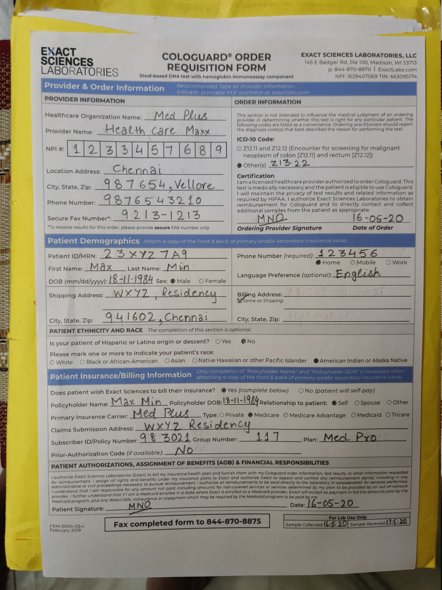
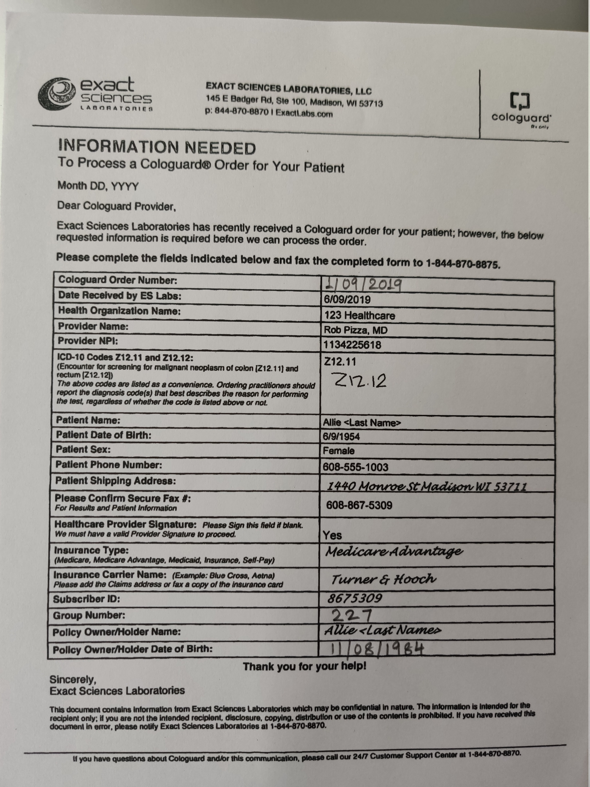

# FORMOCR

This is a submission for Exact Sciences OCR Hackathon. This code is the source code which can be packaged as Linux (Ubuntu), macOS and Windows executable.

## Data Analysis
* We have 2 types of forms and made OCR for both of them for faster processing.
* Form-1

* Form-2

* Form-2 is a simple `key-value` pair.
* Form-1 needs special treatment as the `key-value` pairs are not present in a proper continuous table format.

## Requirement Analysis
* We needed a **robust**, **fast**, **accurate** and **scalable** OCR with **safe** and **secure storage**.
* There are multiple players in this domain. They are as follows-
    1. Google Vision
    2. Google Document AI
    3. Amazon Rekognition
    4. Amazon Textract
    5. Microsoft Computer Vision
    6. Microsoft Form Recogniser
* Need for cross-platform use.
* Need for a **smooth**, **simple** and an **intuitive** user interface.

## Approach
* We tested out with the following APIs first-
    1. Google Vision
    2. Amazon Rekognition
    3. Microsoft Computer Vision
* The main issue we faced was the sensitivity of these APIs for the proper position. using these APIs in their raw format yielded good but not upto the mark result.
* Our solution - Use custom de-skewing method along with border detection and key points detection form both Form-1 and Form-2.
* This increased the accuracy of **Form-2** but we still lacked proper output from **Form-1**.
* On rigorous testing, we found that if due to some reason, the boundaries are blurred or not in the image, **Form-2**'s performnace deteriorates too to a certain extent. This might be an issue for some forms.
* Until now, **Google Vision** worked best followed closely by **Microsoft Computer Vision** and then **Amazon Rekognition**.
* But we needed something **robust**.
* We then tested the following solutions that allowed us to interact directly with documents-
    1. Google Document AI
        * Pros
            1. It detects the values accurately
        * Cons
            1. Some of its services are in Beta phase.
            2. Also, not proper key detection and hence values are assigned to wrong keys.
            3. No ability to customize the API as per our needs.
        * Comment
            * Since some of its features are in Beta phase, it wasn't worth the risk as of now. Also, lack of flexibility to modify according to our needs.
    2. Amazon Textract
        * Pros
            1. It detects keys vey well and is faster that Google Document AI (average time).
            2. Can perform manual checks of someone opts for it.
        * Cons
            1. The values are not well detected.
            2. No ability to customize the detection and extraction as per our needs.
        * Comment
            * Our first guess was that since Amazon works in the delivery business, they might be better in form prsers using OCR as they use it on a daily basis on their products t0 scan invoice. But it failed there.
    3. Microsoft Form Recogniser
        * Pros
            1. We can customize and train the API as per our need based on **Form-1** or **Form-2**.
            2. Faster average time as compared to Google Document AI.
            3. Needs very less amount of data for training as compared to other offline solutions.
            4. Recognizes `key-value` pair very accurately.
        * Cons
            1. Need for some ground work before starting training.
            2. It is faster than Google Document AI but slower than Amazon Textract.
        * Comment
            * The ability to customize and train our own model with less amount of data gave us the best results out of these 6 experiments.
* Now, we customized it for proper de-skewing and prepared **30** handwritten forms for each form type.
* Now came the time for storage. We had to go through multiple options to store data as a large amount of data will be produced from these forms.
* We had **3** preferred options for this. They are as follows-
    1. AWS S3
    2. Google Cloud Storage
    3. Microsoft Azure Storage
* We then tested these 3 options as per our need. The results are as follows-
    


## Initial steps
1. Create an account on `Google Cloud`.
2. You can go ahead and create a trial account or a full account.
3. After the account creation and verification, create a project.
4. Go to `API & Services` and on the top there will be `Enable APIS and Services`. Click that.
5. Search for Google Cloud Storage and enable it (By default, it should be enabled).
6. Create a bucket as told [here](https://cloud.google.com/storage/docs/creating-buckets?authuser=1).
7. Download the credentials json file as told [here](https://cloud.google.com/iam/docs/creating-managing-service-account-keys).
8. Rename the `json` as `visionKey.json`.
9. Get the name of the bucket previously created and put it in the `googleCloudStorage.js` file as shown below.
```javascript
const bucketName = 'ENTER BUCKET NAME HERE';
```
10. After setting up of Google Cloud account for storage, we setup the form api using Microsoft Azure's [Form Recogniser](https://azure.microsoft.com/en-in/services/cognitive-services/form-recognizer/).
11. Create an account which maybe trial or full-time subscription.
12. As mentioned above, the flexibility of the Azure Form Recogniser system is one of the reason why we chose this. Ypu can [label](https://docs.microsoft.com/en-us/azure/cognitive-services/form-recognizer/quickstarts/label-tool) and create your own dataset which we did for **60** handwritten forms. The `SAS URI` can be found under your storage container's menu and goes by the name **Shared Access Signature**.
13. Create your own `resource group` as mentioned in the Azure Form Recogniser docs.
14. **NOTE - This step is only necessary if you want to retrain the whole system again with a lot more images. Also, adding large number of images, after a certain point won't increase the performance much.** You'll have to setup 2 containers. One for `form-1` and one for `form-2` and label them accordingly.
15. Train as given in the doc [here](https://docs.microsoft.com/en-us/azure/cognitive-services/form-recognizer/quickstarts/label-tool) for each form type and save the **Model ID**.
16. Under your `form recogniser` resource, go to **Pricing Tier** and change it to `Standard`.
17. Under your `form recogniser` resource, go to **Overview** to get `Resource Group`, `Endpoint` and `Location`. The `Location` can be mapped to `Region` [here](https://westus2.dev.cognitive.microsoft.com/docs/services/form-recognizer-api/operations/AnalyzeWithCustomModel). For example, in `eastus.api.cognitive.microsoft.com` the region is `eastus`.
18. Under your `form recogniser` resource, go to **Keys and Endpoint** to get the `Subscription Key`. **Key-1** is used by default.
19. Create a file named `credentials.json` which has the following content.
```json
{
	"azure_region":"region",
	"resource_group" :"resource name",
	"form_recognizer_endpoint" :"endpoint",
	"form_recognizer_subscription_key" :"key",
	"form_recognizer_model_id_form1" : "model ID form-1",
	"form_recognizer_model_id_form2" : "model ID form-2",
	"googleBucket": "google bucket name"

}
```
20. Once the keys are changed, new executables need to be generated again or build from the source for the code to work.
21. The need for Azure storage blobs is just for training the model.

## Starting the Project from The Source Code
1. Install python and Pip  based on the platform - mac/linux/windows.
2. After installation test command `python` and `pip` by in command prompt.
3. In command prompt change directory to package folder - FORMOCR.
4. Run `pip install -r requirment.txt`.
5. Install node and npm.
6. Execute `npm install`.
7. Launch the UI from the terminal by command `npm start`.
8. For making Linux (Ubuntu), macOS and Windows executable, run the following commands.
```bash
// For macOS (tested on macOS Mojave)
npm run package-mac

// For Linux (tested on Ubuntu)
npm run package-linux

// For Windows (tested on Windows 10)
npm run package-win
```

**We have used `python3` for development as `python2.7` has been deprecated. There might be an issue on some systems because in some systems `python3` is called `python` and in some systems it is `python3`.** If the code isn't working and showing `ENOENT` error, then do the following in `renderer.js` file.
```javascript
/* if python3 doesn't work, then replace it with python */
var pythonProcess = spawn('python3',[p, '-i', directory]);
```

## For Ubuntu Setup 
1. Install python and pip using the link : `https://docs.python-guide.org/starting/install3/linux/`.
2. After installation test command `python` and `pip` by in command prompt.
3. In command prompt change directory to package folder.
4. Run `pip install -r requirment.txt`.
5. Run `./formocr` for UI.

## For Windows Setup
1. Install python from given link. `https://www.python.org/downloads/`.
2. Make sure to select checkbox of `pip` and `Set Environment Variable`.
3. After installation test command `python` and `pip` by in command prompt.
4. Run `pip install -r requirment.txt`.
5. Run `formocr.exe` for UI.

## For macOS Setup 
1. Install python  and pip using the link : `https://docs.python-guide.org/starting/install3/osx/`.
2. After installation test command `python` and `pip` by in command prompt.
3. In command prompt change directory to package folder.
4. Run `pip install -r requirment.txt`.
5. Run `formocr` for UI.
